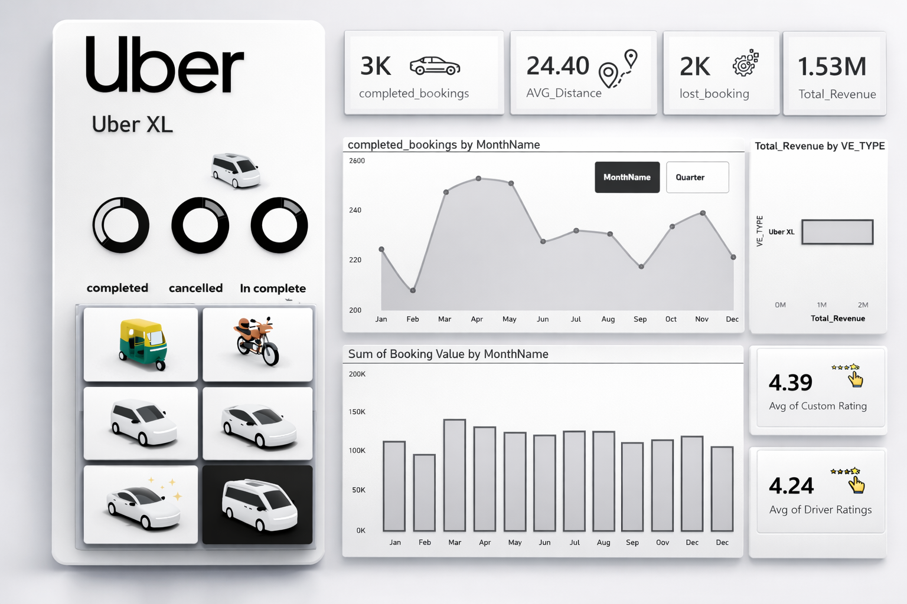

# Uber Rides Power BI Dashboard

This project presents an interactive dashboard developed using Power BI to analyze Uber ride data. The dashboard provides clear insights into booking trends, revenue performance, and vehicle type distribution.

## Project Overview
This project focuses on analyzing Uber ride data to better understand user behavior and ride demand patterns. The dashboard displays key performance indicators (KPIs) in a clear and visual format that helps support data-driven decision making.
### Main Dashboard

### Uber Dashboard

Through this dashboard, users can explore ride data, identify important patterns, and gain valuable insights such as demand trends, vehicle type performance, and booking patterns over time.

## Project Objectives
The main objectives of this project include:

- Analyzing booking trends over time  
- Understanding the distribution of different vehicle types  
- Evaluating revenue performance related to ride bookings  
- Identifying ride demand patterns  
- Building an interactive dashboard that simplifies data analysis and business insights  

## Key Insights
The dashboard provides several important analytical insights, including:

- Total number of bookings  
- Revenue trends over time  
- Distribution of rides by vehicle type  
- Ride demand patterns across different periods  
- Key performance indicators related to ride activity  
## Key Performance Indicators (KPIs)

The dashboard highlights several key metrics including:

- Total Bookings
- Average Distance per Ride
- Total Revenue
- Completed vs Cancelled Rides
- Customer Ratings
- Driver Ratings
  
## Tools & Technologies Used

This project was developed using several data analysis and visualization tools to transform raw Uber ride data into meaningful business insights.

- Microsoft Power BI  
  Used to design the interactive dashboard, create visual reports, and present insights in an intuitive way.

- Power Query 
  Used for data cleaning, transformation, and preparation before building the dashboard.

- DAX (Data Analysis Expressions)
  Used to create calculated measures and metrics such as total bookings, revenue analysis, and performance indicators.

- Data Modeling
  Relationships between tables were created to ensure accurate analysis and reporting.

- Data Visualization Techniques
  Various charts and visuals were used including bar charts, line charts, and KPI cards to clearly present insights.

- Data Cleaning & Preparation
  The dataset was processed to remove inconsistencies and ensure data quality before analysis.

- Interactive Dashboard Design
  Filters, slicers, and interactive visuals were used to allow users to explore the data dynamically.

## Project Files
This repository contains the following files:

- **ubber.pbix**  
  The main Power BI dashboard file containing all visualizations and analysis.

- **data/**  
  The dataset used for analyzing Uber ride data.

## Project Outcome
This project transforms raw ride data into meaningful insights through an interactive dashboard. These insights can help stakeholders better understand ride patterns, evaluate service performance, and support more informed business decisions.

## Author
Malak Abujondi
